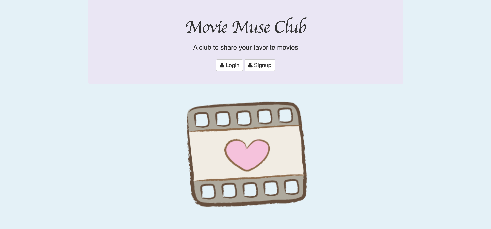
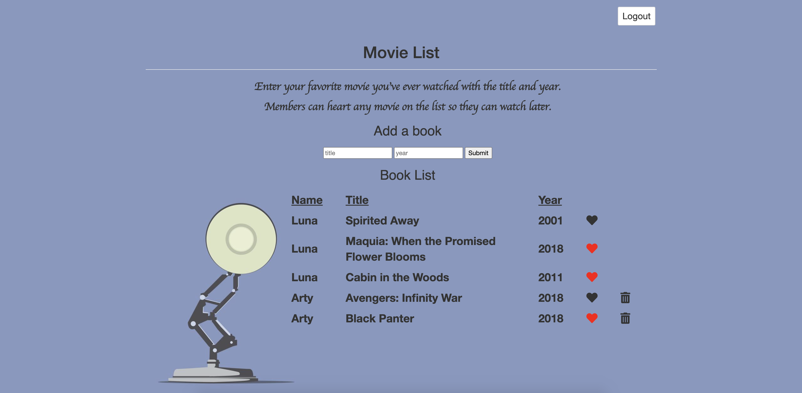

# Movie Muse Club

## Goal:

A full-stack web application that allows multiple users to sign in and post their favorite movies they've watched. Each user has access to the main list and can favorite any movie to watch later.

## How It's Made:

**Tech Used**: HTML5, CSS3, APIs, Javascript, Node.js, MongoDB, Express framework

## Installation

1. Clone repo
2. run `npm install`

## Usage

1. run `node server.js`
2. Navigate to `localhost:8080`

## Credit

Modified from Scotch.io's auth tutorial
